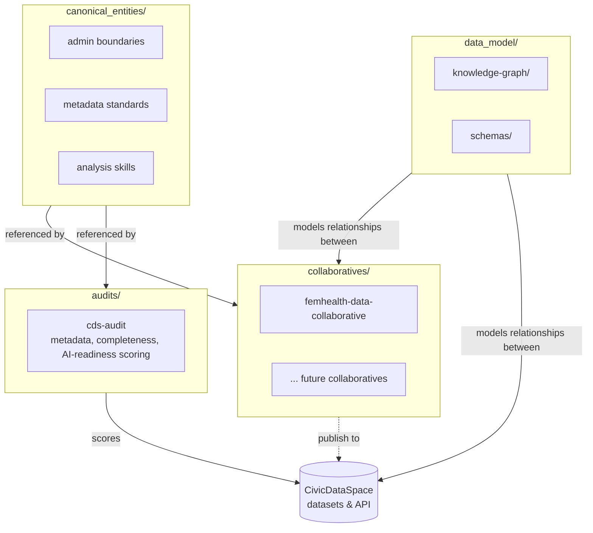

# Architecture

This repository is the single entry point into CivicDataLab's [CivicDataSpace](https://civicdataspace.in)
data ecosystem. It doesn't hold a data pipeline of its own — it holds the tooling, models, and documentation
that tie the ecosystem's collaboratives and datasets together.

## The four parts

**[`collaboratives/`](../collaboratives/)** — each subdirectory is a git submodule pointing at one
collaborative's own repository (its own data, analytics, and pipelines). This repo doesn't vendor their code;
it tracks which commit of each collaborative is current. See [`docs/collaboratives.md`](collaboratives.md) for
the list and how to add a new one.

**[`audits/`](../audits/)** — tooling that audits datasets published to CivicDataSpace against the platform's
dataset uploading guidelines (metadata completeness, file format, encoding, AI-readiness). Currently
`cds-audit`; it's a standalone Python project with its own `pyproject.toml`.

**[`data_model/`](../data_model/)** — knowledge graphs and shared schemas describing how collaboratives,
datasets, and canonical entities relate to one another, for platform intelligence use cases (search, linkage,
recommendation) that span more than one collaborative.

**[`canonical_entities/`](../canonical_entities/)** — the shared reference data every collaborative would
otherwise have to source itself: admin boundary shapefiles, metadata standards, analysis skill definitions.
Region-specific sources are organised by country/region (e.g. `india/maps/` for NIC-sourced boundaries); global
references that aren't tied to one region — like [`metadata-standards/`](../canonical_entities/metadata-standards/),
the DCAT v3 / Dublin Core / Croissant mapping for CivicDataSpace's own dataset schema — sit at the top level.

## Adding to this repo

- **A new collaborative** → add its repo as a submodule under `collaboratives/` (see
  [`docs/collaboratives.md`](collaboratives.md)); nothing else in this repo needs to change unless it should be
  referenced from `data_model/`.
- **A new audit check** → add it inside `audits/cds-audit/src/cds_audit/checks/` (see that project's own
  README).
- **A new canonical entity source** → add a subdirectory under `canonical_entities/`, following the pattern in
  `canonical_entities/india/` (script-relative paths, CLI flags, no interactive-only requirements so it can run
  in CI).
